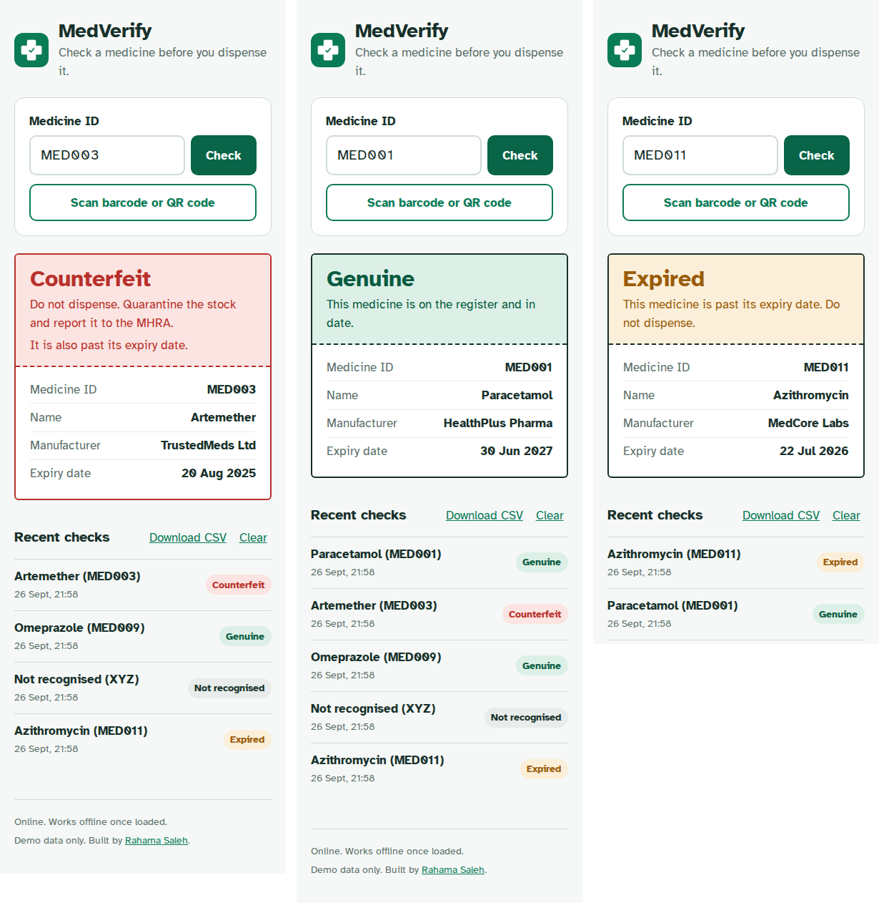

# MedVerify: Medicine Verification System

A progressive web app that lets pharmacists and healthcare workers check whether a medicine is genuine, counterfeit or expired in seconds, by typing its ID or scanning the code on the pack.



## The problem

The World Health Organization estimates that 1 in 10 medical products in low and middle income countries is substandard or falsified. Counterfeit antimalarials and antibiotics are among the most common, and they cause treatment failure, drug resistance and avoidable deaths. Pharmacists need a fast and reliable way to confirm a pack is genuine before it reaches a patient.

## What it does

* **Verifies a medicine instantly** by ID or by scanning a barcode or QR code with the phone camera
* **Gives a clear verdict** of Genuine, Counterfeit, Expired or Not recognised, with the action to take
* **Treats unknown IDs as suspicious**, since falsified packs often carry invented codes
* **Warns when stock is close to expiry** (within 30 days)
* **Keeps an audit trail** of every check with a timestamp, including failed lookups, exportable as CSV
* **Works offline** once loaded, so it remains usable in pharmacies with unreliable internet
* **Installs like a native app** on Android and iOS through the browser

## How it works

The medicine register is stored in `medicines.csv`. The app loads it, matches the entered or scanned ID and decides the verdict in this order: not on the register, flagged as counterfeit, past its expiry date, otherwise genuine. A service worker caches the app and the register so checks continue to work without a connection, while the register itself is refreshed from the network whenever one is available.

QR codes can hold either a plain ID or a link such as `...?id=MED003`, so a pack can be checked with the in app scanner or with any phone camera.

## Try it

Open the live demo and enter `MED001` (genuine), `MED003` (counterfeit), `MED011` (expired) or `FAKE999` (not recognised). To test the scanner, open [test-codes/test-codes.png](test-codes/test-codes.png) on another screen and scan any code.

## Tech stack

HTML, CSS and vanilla JavaScript, a service worker and web app manifest for offline use and installation, and [html5-qrcode](https://github.com/mebjas/html5-qrcode) for camera scanning. Hosted on GitHub Pages.

A command line version of the same logic is included in `verify.py` (Python, standard library only):

```
python verify.py
```

## Project history

This project began as my final year dissertation at De Montfort University, where I designed and prototyped the system in Bubble.io. I have since rebuilt it in code so the full source is open, it can be hosted at no cost and it runs offline.

